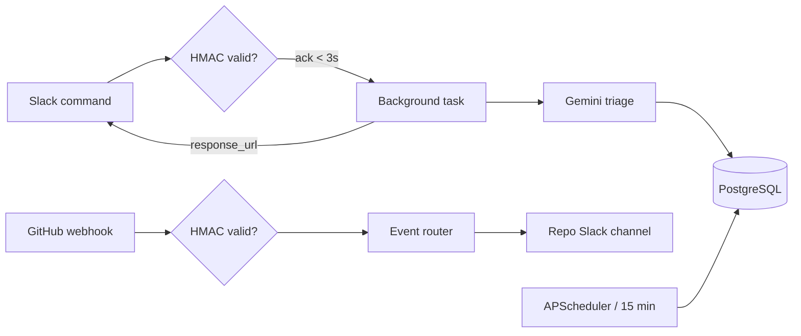

# ResolveOps

**An AI-triaged IT helpdesk and DevOps notifier that lives inside Slack.**

Employees file issues with a slash command. Gemini classifies, prioritizes, and suggests a fix in seconds. A background SLA engine escalates anything left unresolved. GitHub activity (pushes, PRs, and CI runs) is posted to per-repo Slack channels.

**Live demo:** [Health check](https://resolveops.onrender.com/api/health) · [Join the Slack workspace](https://join.slack.com/t/solver-g678160/shared_invite/zt-47kxbtf9z-je55g8UYaiSfeaDa2xQCLQ)
> Free-tier Render host: hit the health check first to wake it up (~30s cold start).

---

## Features

| | |
|---|---|
| **AI triage** | `/ticket <issue>` uses Gemini 2.5 Flash with a strict JSON response schema to assign a category, a priority (1–5), and a suggested fix, which is sent straight back to the user. |
| **Prompt-injection guard** | User text is wrapped in `<user_text>` tags and treated as untrusted data. Embedded instructions are marked as spam with the lowest priority. |
| **SLA auto-escalation** | APScheduler runs every 15 minutes and bumps the priority of any ticket that breaches its window (P2: 2h, P3: 6h, P4: 12h, P5: 24h). |
| **Admin workflow** | `/listissue` (priority-sorted queue), `/resolve <id>`, and `/add-admin @user`, all gated by role checks against the database. |
| **Abuse protection** | Users are auto-registered on first use, and each user has a daily cap on tickets. |
| **GitHub → Slack** | Push, pull request, and `workflow_run` events are routed to each repo's Slack channel as Block Kit messages. |
| **Request security** | HMAC verification of Slack signatures (with replay protection) and GitHub `X-Hub-Signature-256`. Invalid requests get a 403. |
| **Built for Slack's 3s limit** | Every webhook acknowledges immediately. The slow work (AI calls, database, Slack API) runs in background tasks and replies through `response_url`. |

## Tech Stack

**Backend:** Python, FastAPI, Uvicorn, httpx (async)  
**Data:** PostgreSQL, SQLAlchemy, Pydantic  
**AI:** Google Gemini 2.5 Flash (structured output)  
**Automation:** APScheduler  
**Integrations:** Slack Slash Commands and Web API, GitHub Webhooks  
**Testing / Deploy:** Pytest, Render

## Architecture


```mermaid
flowchart LR
    S[Slack command] --> V{HMAC valid?} -->|ack < 3s| BG[Background task]
    BG --> AI[Gemini triage] --> DB[(PostgreSQL)]
    BG -->|response_url| S
    GH[GitHub webhook] --> V2{HMAC valid?} --> R[Event router] --> CH[Repo Slack channel]
    SCH[APScheduler / 15 min] --> DB
```

## Project Structure

```
backend/
├── main.py      # Routes, GitHub event router, scheduler lifecycle
├── ai.py        # Gemini prompt, schema-enforced triage, injection guard
├── sla.py       # SLA windows + escalation job
├── crud.py      # DB ops, background workers
├── slack_blocks.py  # Slack Block Kit message builders
├── auth.py      # Slack/GitHub signature checks, admin RBAC
└── models.py / schemas.py / database.py
testing/
├── test_ai_response.py   # Verifies Gemini triage output shape & category
└── test_crud.py          # End-to-end ticket insertion
```

## Quick Start

```bash
git clone https://github.com/<your-username>/ResolveOps.git && cd ResolveOps
pip install -r requirements.txt
# .env → DATABASE_URL, GEMINI_API, BOT_AUTH_TOKEN, SIGNING_SECRET, GITHUB_SECRET
uvicorn backend.main:app --reload
pytest testing/
```

Point the Slack slash commands at `/webhook/{ticket,listissue,resolve,add-admin}` and the GitHub webhook at `/webhook/github` (push, PR, and workflow run events).

## Roadmap

- Async SQLAlchemy / `asyncpg` so database calls don't block the event loop
- Move the scheduler to a dedicated worker for horizontal scaling
- Mocked unit tests and CI on every push

---

Built by **Jairam Hegde**
